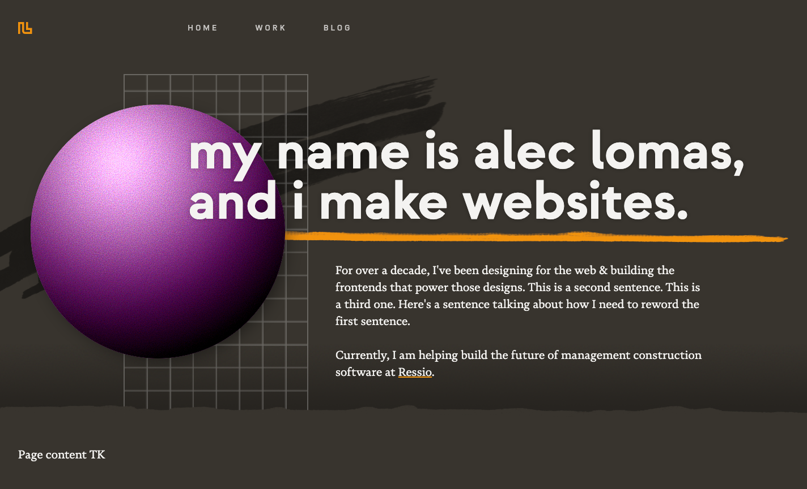

The last time I redesigned this website was in April 2020. I guess as far as motivating factors go, being stuck inside all day due to a global pandemic is a strong one. By contrast for the last year my homepage has displayed the wrong employer and the service that I built to serve stats has been crippled by a _certain_ service all of a sudden charging exorbitant fees for API access. Still a motivating factor, albeit a demonstrably smaller one. But here we finally are: the infamous self-indulgant redesign blog post. Let's dive in.

## The Right Tool For the Job

Before getting started on any project you need to evaluate the tools that best fit what you're trying to accomplish. For a website like this, the most important tool is the one used to actually generate your webpages. Historically I've used a redesign as an excuse to try out some new-to-me technology along these lines. For [v3](https://v3.lowmess.com), it was [Gatsby](https://gatsbyjs.com); for [v4](https://v4-1.lowmess.com) it was [GraphQL](https://graphql.org/), [Apollo](https://www.apollographql.com/), and (eventually) [Next.js](https://nextjs.org). This time, I knew I didn't want to rely on a [React](https://react.dev)-based framework for a content-driven website. While I briefly considered [Eleventy](https://11ty.dev), I decided to reach for a tool I had already used on a few recent [projects](/work): [Astro](https://astro.build).

As someone who has primarily worked with React since 2018, I love that Astro brought the developer experience of a component-first library to the world of content-first frameworks. The [islands architecture](https://docs.astro.build/en/concepts/islands/) means I can always add highly interactive sections -- maybe even powered by React -- without including large amounts of JavaScript on every single page. The [Content Layer API](https://docs.astro.build/en/guides/content-collections/) means I get type-safe autocompletion when developing layouts and components for blog posts, projects, and any other shaped data I want to add later. And best of all, I get all of that _and_ first-class support for markdown, RSS, and all the other goodies you'd want on a largely static portfolio/blog. This is the third website I've built with Astro, but it will not be the last.

## The Design Concept

When I first designed my logo, I knew the single-width nature of it would make it easy to extend. I whipped up [some tileable patterns](/images/patterns-showcase.png) but outside of a social media header here-and-there I didn't explore the concept any further. Which is a very long-winded way of saying it took me an embarassingly long eight years to realize I could use it as a border element. Flip it around on the bottom and you have a playing card/ornamental frame motif -- now we're cookin'. (Hover over the corners for a little reveal animation).

When designing websites (or features on an application), I generally move straight from lo-fi pen & paper sketches straight into the browser and this was no exception. That meant that some elements (the decision to reveal the logo on hover instead of it always being more clearly delineated, for example) happened once I opened my code editor.

### Developing the Concept

One thing I knew from the beginning was that I wanted to border to both surround the content and overlap a page-width footer. I explored a few approaches to this, but ultimately landed on the simplest of the bunch: I added a separate border to the `<nav>`, `<main>`, and `<footer>` content and ensured there was no vertical spacing between those elements. My logo is designed on a very rigid, evenly spaced grid so I was able to derive the logo size from the desired outline width and have the sizes match up perfectly.

```css
:root {
	/* you can actually find and manipulate this variable in the element inspector: */
	--outline-width: 8px;
	--logo-width: calc(var(--outline-width) * 7);
}
```

I then needed to offset the logo to get it to line up. Add in a psuedo-element with the document background color and you can "hide" where the border intersects with the negative space of the logo.

```css
.logo {
	position: relative;
	top: calc(var(--outline-width) * -1);
	left: calc(var(--outline-width) * -1);
	width: var(--logo-width);
	aspect-ratio: 7 / 6;

	&::before {
		content: "";
		position: absolute;
		top: 0;
		right: calc(var(--outline-width) * 3);
		bottom: calc(100% - var(--outline-width));
		left: 0;
		background-color: var(--background-color);
	}
}
```

I basically just did the same thing for the logo in the footer, but applied a 180 degree rotation. Pretty simple solution for a pretty simple design. A few hours playing with different treatments (such as the aforementioned show/reveal change) and animations, and I was in business.

### Designing the Content

Simple as it is, it took me a while to land on the homepage design. I tried quite a few visual elements that for one reason or another just didn't work. Then I thought it would be funny if I just listed out all my old employers with their names crossed out. I was right. It is.

The other pages are -- from a layout perspective -- basically the same as [the previous design](https://v4-1.lowmess.com). Kind of boring for a redesign but the pages are so simple for now that the solutions work really well. The exceptions here are [the archive](/archive) which is now a timeline, [the colophon](/colophon) which got a layout tweak on larger devices, and [my résumé](/resume) which used to be its own site. I also addded [a graveyard](/blog/archive) where I can send misbehaving posts, but that page is a secret.

### Defining the Tokens

Apart from my beloved [`Dank Mono`](https://philpl.gumroad.com/l/dank-mono), all fonts are from [atipo foundry](https://www.atipofoundry.com/). Headlines are set in [Strawford](https://www.atipofoundry.com/fonts/strawford), body text in [Novela](https://www.atipofoundry.com/fonts/novela), and supporting elements are set in [Izoard](https://www.atipofoundry.com/fonts/izoard). No real secret here -- they pair well, I wanted to set body copy in a serif, and I own them. I may switch Strawford out for another geometric with a taller x-height at some point, but the others are staying. Probably.

The type scale was generated using [the Utopia fluid type scale calculator](https://utopia.fyi/type/calculator), a wonderful tool. In general, I used a 2x `px` scale (`2px`, `4px`, `8px`, `16px`, ...) for inline spacing and integer [`rlh`](https://developer.mozilla.org/en-US/docs/Web/CSS/length#rlh) units for block spacing. Each color is derived from a single brand color swatch using [CSS relative colors](https://developer.mozilla.org/en-US/docs/Web/CSS/CSS_colors/Relative_colors). They kinda hit it out of the park with the syntax on that one.

## Other Concepts

Four and a half years is a long time to let a design sit, and over the years I did have other ideas for a redesign. Only two of them really made it past the "quick sketch in my nearest Field Notes" phase.

### Concept 1: Even More Stats

Prior to [Twitter's API pricing restructure](https://www.theverge.com/2023/3/30/23662832/twitter-api-tiers-free-bot-novelty-accounts-basic-enterprice-monthly-price), I was actually planning on leaning into the stats nerdery of [the previous design](https://v4-1.lowmess.com) even more. There were a few ideas here. Most of them were obvious graph/timeline views, but my favorite was a receipt that would print out from the nav bar on each visit, dot matrix style. I started sketching out what the API/service would look like, but ultimately decided to abandon the idea when Reddit & Twitter decided that Web2.0 was dead.

### Concept 2: VHS Tape Cover

I love old VHS tape covers, particularly [this Scotch EG one](/images/scotch-eg-tape.jpg). I started sketching out compositions that included elements of those tape covers, especially grids and chrome spheres. I took one to the browser, and got pretty far:

<figure>



<figcaption>You can't tell from this still image, but [the grid is animated](https://codepen.io/lowmess/full/GgKrxyW).</figcaption>
</figure>

It was a fun concept, but it felt unresolved and I knew I would need a bunch of different lockups to prevent it from getting stale on other pages. Also responsiveness was going to be a massive pain. (I toyed around with [a sort of mid-century modern version](https://codepen.io/lowmess/full/XWQedrg), but abandoned it for the same reasons.) Still, I might dust this off the shelf for the next redesign.

## What's Next

A redesign is never really complete the same way a website or any other creative endeavor is never really complete. Some of the refinements are unforeseen. Others less so: I'd like to add some intro animations to various elements on pages and [view transitions](https://developer.mozilla.org/en-US/docs/Web/CSS/CSS_view_transitions) once the CSS-only API is available. Once [`text-box`](https://caniuse.com/css-text-box-trim) starts landing in browsers I will hopefully be able to align all the text across the site on a consistent baseline.

In general I'm also looking forward to getting back into the habit of writing blog posts. I have some ideas for more medium-to-long posts, but adding support for short link + blurb style posts is also on the roadmap. This also means expanding the things I write about here. I do actually care about a lot of things that aren't related to design or development, and I think it would be a good idea for my personal website to reflect that.

## What Did We Learn

This post probably didn't need to be nearly 1,500 words long. That's the first thing we learned. We also learned that Astro is awesome and that five years is too long to go without redesigning your website. Fortunately, it only took me four years and eight months.
